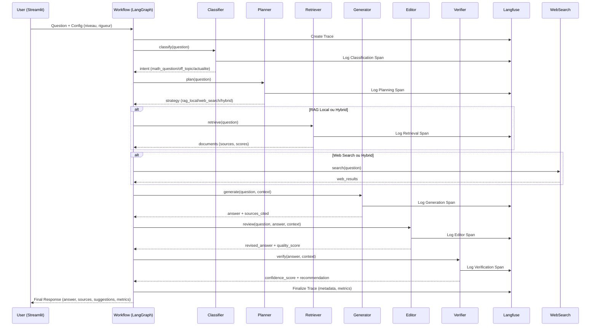

# Documentation Technique - Math RAG System

**Version**: 1.0.0
**Date**: Novembre 2025
**Auteur**: Paul Montier

---

## Table des Matières

1. [Vue d'ensemble du système](#1-vue-densemble-du-système)
2. [Architecture technique](#2-architecture-technique)
3. [Workflow multi-agent LangGraph](#3-workflow-multi-agent-langgraph)
4. [Composants système](#4-composants-système)
5. [Système de vectorisation](#5-système-de-vectorisation)
6. [Observabilité et traçage Langfuse](#6-observabilité-et-traçage-langfuse)
7. [Gestion des LLM](#7-gestion-des-llm)
8. [Interface utilisateur](#8-interface-utilisateur)
9. [Configuration et déploiement](#9-configuration-et-déploiement)
10. [Performances et optimisations](#10-performances-et-optimisations)
11. [Sécurité](#11-sécurité)
12. [Tests et validation](#12-tests-et-validation)
13. [Troubleshooting](#13-troubleshooting)

---

## 1. Vue d'ensemble du système

### 1.1 Objectif

Le Math RAG System est un système de question-réponse spécialisé pour les mathématiques, utilisant une architecture multi-agent orchestrée par LangGraph. Le système combine:
- **RAG local** (Retrieval-Augmented Generation) avec FAISS
- **Recherche web** pour informations actuelles
- **Stratégies hybrides** adaptatives selon le contexte
- **Traçage complet** avec Langfuse pour observabilité LLM

### 1.2 Cas d'usage

- Répondre à des questions mathématiques de niveau L1 à Agrégation
- Adapter la rigueur et le niveau de détail selon l'étudiant
- Fournir des sources académiques fiables (cours, polycopiés, exercices)
- Suggérer des questions de suivi pédagogiques
- Traiter des questions d'actualité mathématique (via web search)

### 1.3 Caractéristiques techniques principales

| Caractéristique | Technologie | Justification |
|-----------------|-------------|---------------|
| Orchestration multi-agent | LangGraph | Gestion d'état robuste, conditionnalité, checkpoints |
| Recherche vectorielle | FAISS (Facebook AI) | Performance, scalabilité, support GPU |
| Embeddings | Sentence-Transformers (multilingual) | Support français, qualité, open-source |
| LLM Cloud | OpenAI GPT-4o, Anthropic Claude | Qualité, raisonnement mathématique |
| LLM Local | Ollama (Mistral, Llama) | Confidentialité, coût zéro, offline |
| Observabilité | Langfuse | Traçage LLM, métriques, debugging |
| Interface | Streamlit | Rapidité développement, interactivité |
| Extraction PDF | PyPDF2 + pdfplumber + OCR | Robustesse, formules LaTeX |

---

## 2. Architecture technique

### 2.1 Architecture globale

```
┌─────────────────────────────────────────────────────────────────┐
│                      INTERFACE STREAMLIT                         │
│  (src/interface/app.py)                                         │
│  - Input utilisateur (question, niveau, rigueur)                │
│  - Affichage réponse enrichie (sources, suggestions, métriques) │
└────────────────────────┬────────────────────────────────────────┘
                         │
                         ▼
┌─────────────────────────────────────────────────────────────────┐
│              WORKFLOW LANGGRAPH MULTI-AGENT                      │
│  (src/workflow/langgraph_pipeline.py)                          │
│                                                                  │
│  ┌──────────┐   ┌──────────┐   ┌──────────┐   ┌──────────┐   │
│  │Classifier│──▶│ Planner  │──▶│Retriever │──▶│Generator │   │
│  └──────────┘   └──────────┘   └──────────┘   └──────────┘   │
│                                      │              │           │
│                                      ▼              ▼           │
│                                 ┌──────────┐   ┌──────────┐   │
│                                 │Web Search│   │ Editor   │   │
│                                 └──────────┘   └──────────┘   │
│                                                     │           │
│                                                     ▼           │
│                                                ┌──────────┐    │
│                                                │ Verifier │    │
│                                                └──────────┘    │
└────────────────────────┬────────────────────────────────────────┘
                         │
         ┌───────────────┼───────────────┐
         ▼               ▼               ▼
┌─────────────┐  ┌─────────────┐  ┌─────────────┐
│  LLM Clients│  │Vector Store │  │Web Search   │
│             │  │   (FAISS)   │  │  (Tavily)   │
│ - OpenAI    │  │             │  │             │
│ - Anthropic │  │ Embeddings: │  │             │
│ - Ollama    │  │ Sentence-   │  │             │
│             │  │ Transformers│  │             │
└─────────────┘  └─────────────┘  └─────────────┘
         │               │               │
         └───────────────┼───────────────┘
                         ▼
              ┌─────────────────────┐
              │   OBSERVABILITÉ     │
              │    (Langfuse)       │
              │                     │
              │ - Traces            │
              │ - Spans             │
              │ - Generations       │
              │ - Métriques         │
              │ - Cost tracking     │
              └─────────────────────┘
```

### 2.2 Flux de données principal



### 2.3 Stack technique détaillée

#### Backend
- **Python 3.11+**: Type hints, performance, async support
- **LangGraph 0.2+**: Orchestration workflow avec state management
- **LangChain 1.0+**: Abstractions LLM, prompts, chains (utilisé partiellement)
- **FAISS 1.8+**: Recherche vectorielle haute performance
- **Sentence-Transformers 3.0+**: Embeddings multilingues

#### LLM Providers
- **OpenAI API**: GPT-4o, GPT-4o-mini (raisonnement mathématique)
- **Anthropic API**: Claude 3.5 Sonnet (raisonnement, contexte long)
- **Ollama**: Mistral 7B, Llama 3.1 (local, offline, privacy)

#### Observabilité
- **Langfuse 2.21+**: Traçage manuel LLM, spans hiérarchiques
- **Custom metrics**: Cost tracking, latency, confidence scores

#### Interface
- **Streamlit 1.32+**: Interface web interactive
- **Plotly**: Visualisations métriques (optionnel)

#### Stockage
- **FAISS Index**: Fichiers `.faiss` + `.pkl` (métadonnées)
- **SQLite**: Checkpoints LangGraph (workflow.db)
- **JSON**: Configuration, test data

---

## 3. Workflow multi-agent LangGraph

### 3.1 Définition du state

Le state LangGraph est une `TypedDict` immuable partagée entre tous les nœuds:

```python
class WorkflowState(TypedDict):
    # Input
    question: str
    student_level: str  # "L1", "L2", "L3", "M1", "M2", "Agreg"
    rigor_level: str    # "concis", "détaillé", "rigoureux"

    # Classification
    intent: str         # "math_question", "off_topic", "actualite"

    # Planning
    search_strategy: str  # "rag_local", "web_search", "hybrid"

    # Retrieval
    retrieved_docs: List[Dict]
    context: str

    # Generation
    generated_answer: str
    sources_cited: List[str]

    # Editor
    editor_quality_score: float
    needs_revision: bool

    # Verification
    confidence_score: float
    verification_result: Dict

    # Output
    final_response: str
    success: bool

    # Metadata
    metadata: Dict[str, Any]
    start_time: float
    error_message: Optional[str]

    # Langfuse tracing
    langfuse_trace: Optional[Any]
    langfuse_current_span: Optional[Any]
```

### 3.2 Graphe de workflow

```python
# src/workflow/langgraph_pipeline.py

def create_rag_workflow(config: Dict[str, Any]) -> StateGraph:
    """Crée le workflow LangGraph."""

    workflow = StateGraph(WorkflowState)

    # Ajouter les nœuds
    workflow.add_node("classify", classify_node)
    workflow.add_node("plan", plan_node)
    workflow.add_node("retrieve", retrieve_node)
    workflow.add_node("web_search", web_search_node)
    workflow.add_node("generate", generate_node)
    workflow.add_node("editor", editor_node)
    workflow.add_node("verify", verify_node)

    # Définir le point d'entrée
    workflow.set_entry_point("classify")

    # Routing conditionnel après classification
    workflow.add_conditional_edges(
        "classify",
        should_continue_after_classification,
        {
            "plan": "plan",
            "end": END
        }
    )

    # Routing conditionnel après planning (stratégie)
    workflow.add_conditional_edges(
        "plan",
        route_after_planning,
        {
            "retrieve": "retrieve",
            "web_search": "web_search",
            "hybrid": "retrieve"  # Hybrid commence par RAG
        }
    )

    # Edges linéaires
    workflow.add_edge("retrieve", "generate")
    workflow.add_edge("web_search", "generate")
    workflow.add_edge("generate", "editor")
    workflow.add_edge("editor", "verify")
    workflow.add_edge("verify", END)

    return workflow.compile(checkpointer=MemorySaver())
```

### 3.3 Nœuds détaillés

#### Classifier Node

**Rôle**: Déterminer l'intention de la question (math, hors-sujet, actualité).

```python
def classify_node(state: WorkflowState, config: Any) -> WorkflowState:
    """Nœud: Classification de l'intention."""

    # Créer span Langfuse pour traçabilité
    span = create_node_span(
        trace=state.get("langfuse_trace"),
        node_name="classify",
        input_data={"question": state["question"][:100]}
    )

    # Stocker span dans state ET context variable (propagation)
    state["langfuse_current_span"] = span
    set_current_langfuse_span(span)

    # Récupérer agent depuis config
    classifier: ClassifierAgent = config["classifier"]

    # Classifier avec LLM
    classification = classifier.classify(state["question"])

    # Mettre à jour state
    state["intent"] = classification.intent.value
    state["metadata"]["classification"] = {
        "intent": classification.intent.value,
        "confidence": classification.confidence,
        "reasoning": classification.reasoning
    }

    # Finaliser span avec résultats
    finalize_node_span(span, {
        "intent": classification.intent.value,
        "confidence": classification.confidence
    })

    return state
```

**Prompt système (ClassifierAgent)**:
```python
SYSTEM_PROMPT = """Tu es un classificateur d'intention pour un système de questions mathématiques.

Catégories:
- math_question: Question mathématique (théorie, exercice, démonstration)
- off_topic: Question hors mathématiques
- actualite: Question d'actualité mathématique récente

Analyse la question et retourne:
{
    "intent": "math_question" | "off_topic" | "actualite",
    "confidence": 0.0-1.0,
    "reasoning": "Explication brève"
}
"""
```

#### Planner Node

**Rôle**: Choisir la stratégie de recherche (RAG local, web, hybride).

**Décision basée sur**:
- Mots-clés temporels ("récent", "2024", "actualité") → web_search
- Théorie/définitions classiques → rag_local
- Questions complexes nécessitant contexte + actualité → hybrid

```python
def plan_node(state: WorkflowState, config: Any) -> WorkflowState:
    """Nœud: Planification de la stratégie."""

    span = create_node_span(...)
    set_current_langfuse_span(span)

    planner: PlannerAgent = config["planner"]

    # Décider stratégie avec LLM
    decision = planner.plan(state["question"])

    state["search_strategy"] = decision.strategy.value
    state["metadata"]["planning"] = {
        "strategy": decision.strategy.value,
        "confidence": decision.confidence,
        "reasoning": decision.reasoning
    }

    finalize_node_span(span, {...})
    return state
```

#### Retriever Node

**Rôle**: Récupérer documents pertinents depuis FAISS.

```python
def retrieve_node(state: WorkflowState, config: Any) -> WorkflowState:
    """Nœud: Récupération RAG."""

    span = create_node_span(...)
    retriever: RetrieverAgent = config["retriever"]

    # Recherche vectorielle
    results = retriever.retrieve(
        question=state["question"],
        filters={"level": state["student_level"]}  # Filtrage optionnel
    )

    # Stocker résultats
    state["retrieved_docs"] = [
        {
            "content": r.content,
            "source": r.metadata.get("source"),
            "score": r.score,
            "page": r.metadata.get("page")
        }
        for r in results
    ]

    # Construire contexte pour génération
    state["context"] = "\n\n".join([
        f"[Source: {r.metadata.get('source')}, p.{r.metadata.get('page')}]\n{r.content}"
        for r in results
    ])

    finalize_node_span(span, {"docs_found": len(results)})
    return state
```

#### Generator Node

**Rôle**: Générer la réponse en utilisant le contexte récupéré.

```python
def generate_node(state: WorkflowState, config: Any) -> WorkflowState:
    """Nœud: Génération de réponse."""

    span = create_node_span(...)
    generator: GeneratorAgent = config["generator"]

    # Générer réponse avec contexte
    response = generator.generate(
        question=state["question"],
        context=state["context"],
        retrieved_results=state.get("retrieved_docs"),
        student_level=state["student_level"],
        rigor_level=state["rigor_level"]
    )

    # Stocker réponse et sources
    state["generated_answer"] = response.answer
    state["sources_cited"] = response.sources
    state["metadata"]["generation"] = {
        "tokens": response.llm_response.usage.get("total_tokens", 0),
        "cost": response.llm_response.cost,
        "has_formulas": response.metadata.get("has_formulas", False),
        "suggestions": response.metadata.get("suggestions", [])
    }

    finalize_node_span(span, {"response_length": len(response.answer)})
    return state
```

**Prompt système (GeneratorAgent)**:
```python
SYSTEM_PROMPT = """Tu es un assistant mathématique pédagogique.

Contexte: {context}

Question: {question}
Niveau étudiant: {student_level}
Rigueur demandée: {rigor_level}

Instructions:
1. Réponds précisément à la question en utilisant le contexte fourni
2. Adapte la rigueur selon le niveau (L1=intuitif, Agreg=rigoureux)
3. Cite tes sources: [Source: nom_fichier.pdf, p.X]
4. Utilise LaTeX pour les formules: $...$  ou $$...$$
5. Propose 2-3 suggestions de questions de suivi pertinentes

Format de réponse:
{
    "answer": "Réponse détaillée avec sources...",
    "sources": ["source1.pdf:p.5", "source2.pdf:p.12"],
    "suggestions": ["Question 1?", "Question 2?"]
}
"""
```

#### Editor Node

**Rôle**: Réviser et améliorer la qualité de la réponse.

```python
def editor_node(state: WorkflowState, config: Any) -> WorkflowState:
    """Nœud: Review et amélioration."""

    span = create_node_span(...)
    editor: EditorAgent = config["editor"]

    # Review de la réponse
    review = editor.review(
        question=state["question"],
        generated_answer=state["generated_answer"],
        context=state.get("context"),
        sources_cited=state["sources_cited"]
    )

    # Appliquer révisions si nécessaire
    if review.needs_revision and review.revised_answer:
        state["generated_answer"] = review.revised_answer
        state["needs_revision"] = True
    else:
        state["needs_revision"] = False

    state["editor_quality_score"] = review.quality_score
    state["metadata"]["editor"] = {
        "quality_score": review.quality_score,
        "issues_found": review.issues_found,
        "reasoning": review.reasoning
    }

    finalize_node_span(span, {"quality_score": review.quality_score})
    return state
```

**Critères d'évaluation**:
- Pertinence de la réponse
- Exactitude mathématique
- Citations de sources correctes
- Adaptation au niveau de l'étudiant
- Clarté et pédagogie

#### Verifier Node

**Rôle**: Vérification finale de qualité et confiance.

```python
def verify_node(state: WorkflowState, config: Any) -> WorkflowState:
    """Nœud: Vérification de qualité."""

    span = create_node_span(...)
    verifier: VerifierAgent = config["verifier"]

    # Vérifier qualité finale
    verification = verifier.verify(
        question=state["question"],
        answer=state["generated_answer"],
        context=state["context"],
        sources_cited=state["sources_cited"]
    )

    state["confidence_score"] = verification.confidence_score
    state["verification_result"] = {
        "is_valid": verification.is_valid,
        "confidence": verification.confidence_score,
        "recommendation": verification.recommendation
    }

    # Décision finale
    if verification.is_valid and verification.confidence_score >= 0.7:
        state["final_response"] = state["generated_answer"]
        state["success"] = True
    else:
        state["final_response"] = "Je ne peux pas répondre avec suffisamment de confiance."
        state["success"] = False

    finalize_node_span(span, {"confidence": verification.confidence_score})
    return state
```

### 3.4 Routing conditionnel

```python
def should_continue_after_classification(state: WorkflowState) -> str:
    """Router après classification."""
    intent = state.get("intent")

    if intent == "off_topic":
        # Court-circuiter le workflow
        state["final_response"] = "Cette question est hors du domaine mathématique."
        return "end"

    return "plan"


def route_after_planning(state: WorkflowState) -> str:
    """Router selon stratégie planifiée."""
    strategy = state.get("search_strategy")

    if strategy == "rag_local":
        return "retrieve"
    elif strategy == "web_search":
        return "web_search"
    elif strategy == "hybrid":
        return "retrieve"  # Hybrid commence par RAG puis web
    else:
        return "retrieve"  # Fallback
```

---

## 4. Composants système

### 4.1 Agents (src/agents/)

#### ClassifierAgent

**Fichier**: `src/agents/classifier.py`

**Responsabilité**: Classifier l'intention de la question.

**Attributs**:
- `llm_client`: Client LLM (OpenAI, Anthropic, Ollama)
- `system_prompt`: Template de prompt système

**Méthodes**:
```python
def classify(self, question: str) -> Classification:
    """
    Classifie l'intention d'une question.

    Args:
        question: Question utilisateur

    Returns:
        Classification(intent, confidence, reasoning)
    """
```

**Output**:
```python
@dataclass
class Classification:
    intent: IntentType  # MATH_QUESTION, OFF_TOPIC, ACTUALITE
    confidence: float   # 0.0-1.0
    reasoning: str      # Explication
```

#### PlannerAgent

**Fichier**: `src/agents/planner.py`

**Responsabilité**: Décider de la stratégie de recherche.

**Logique de décision**:
1. Analyse de mots-clés temporels → web_search
2. Questions théoriques classiques → rag_local
3. Questions complexes → hybrid

**Output**:
```python
@dataclass
class PlanningDecision:
    strategy: SearchStrategy  # RAG_LOCAL, WEB_SEARCH, HYBRID
    confidence: float
    reasoning: str
```

#### RetrieverAgent

**Fichier**: `src/agents/retriever.py`

**Responsabilité**: Récupérer documents pertinents depuis FAISS.

**Pipeline de récupération**:
1. Embed query avec Sentence-Transformers
2. Recherche FAISS (k=10 par défaut)
3. Filtrage par métadonnées (niveau, source)
4. Reranking par score de similarité
5. Retour des top-k documents

**Output**:
```python
@dataclass
class RetrievalResult:
    content: str            # Texte du chunk
    score: float            # Similarité cosine
    metadata: Dict[str, Any]  # source, page, level, etc.
```

#### GeneratorAgent

**Fichier**: `src/agents/generator.py`

**Responsabilité**: Générer la réponse finale avec contexte.

**Pipeline de génération**:
1. Construction du prompt avec contexte
2. Appel LLM (GPT-4o ou Claude 3.5)
3. Parsing de la réponse JSON
4. Extraction des sources citées
5. Génération de suggestions de suivi

**Output**:
```python
@dataclass
class GenerationResponse:
    answer: str                # Réponse complète
    sources: List[str]         # Sources citées
    llm_response: LLMResponse  # Métadonnées LLM (tokens, cost)
    metadata: Dict[str, Any]   # suggestions, has_formulas, etc.
```

#### EditorAgent

**Fichier**: `src/agents/editor.py`

**Responsabilité**: Review et amélioration de la réponse.

**Critères de review**:
- Pertinence par rapport à la question
- Exactitude mathématique (formules, théorèmes)
- Qualité des citations de sources
- Adaptation au niveau de l'étudiant
- Clarté pédagogique

**Output**:
```python
@dataclass
class EditorReview:
    quality_score: float          # 0.0-1.0
    needs_revision: bool
    revised_answer: Optional[str]  # Si révision nécessaire
    issues_found: List[str]
    reasoning: str
```

#### VerifierAgent

**Fichier**: `src/agents/verifier.py`

**Responsabilité**: Vérification finale de qualité.

**Critères de vérification**:
- Cohérence entre question et réponse
- Présence de sources fiables
- Niveau de confiance global
- Recommandation d'action (accept/reject/revise)

**Output**:
```python
@dataclass
class Verification:
    is_valid: bool
    confidence_score: float  # 0.0-1.0
    recommendation: str      # "accept", "revise", "reject"
    reasoning: str
```

#### WebSearchAgent

**Fichier**: `src/agents/web_searcher.py`

**Responsabilité**: Recherche web (Tavily API).

**Pipeline de recherche**:
1. Formulation de query optimisée
2. Appel Tavily API (search_depth="advanced")
3. Filtrage des résultats académiques
4. Extraction de snippets pertinents

**Output**:
```python
@dataclass
class WebSearchResult:
    results: List[Dict]  # [{url, title, snippet, score}]
    query: str
    total_results: int
```

### 4.2 Clients LLM (src/llm/)

#### Closed Models (OpenAI, Anthropic)

**Fichier**: `src/llm/closed_models.py`

**Fonction principale**:
```python
def get_llm_client(
    provider: str = "openai",
    model_name: str = "gpt-4o",
    temperature: float = 0.1,
    max_tokens: int = 4096
) -> LLMClient:
    """
    Retourne un client LLM configuré.

    Providers supportés:
    - openai: gpt-4o, gpt-4o-mini, gpt-4-turbo
    - anthropic: claude-3-5-sonnet-20241022

    Args:
        provider: Provider LLM
        model_name: Nom du modèle
        temperature: Température (0=déterministe, 1=créatif)
        max_tokens: Limite de tokens de sortie

    Returns:
        LLMClient: Client configuré avec méthodes invoke(), stream()
    """
```

**Abstraction**:
```python
class LLMClient(Protocol):
    def invoke(
        self,
        messages: List[Dict[str, str]],
        response_format: Optional[Dict] = None
    ) -> LLMResponse:
        """Appel synchrone LLM."""

    def stream(
        self,
        messages: List[Dict[str, str]]
    ) -> Iterator[str]:
        """Appel streaming LLM."""
```

**LLMResponse**:
```python
@dataclass
class LLMResponse:
    content: str                  # Texte généré
    usage: Dict[str, int]         # {prompt_tokens, completion_tokens, total_tokens}
    cost: float                   # Coût en USD
    model: str                    # Modèle utilisé
    latency: float                # Temps de réponse en secondes
    finish_reason: str            # "stop", "length", "content_filter"
```

**Cost tracking**:
```python
# Tarifs OpenAI GPT-4o (Nov 2024)
PRICING = {
    "gpt-4o": {
        "input": 0.0025,   # $/1k tokens
        "output": 0.01     # $/1k tokens
    },
    "gpt-4o-mini": {
        "input": 0.00015,
        "output": 0.0006
    }
}

def calculate_cost(usage: Dict, model: str) -> float:
    """Calcule le coût d'un appel LLM."""
    input_cost = usage["prompt_tokens"] / 1000 * PRICING[model]["input"]
    output_cost = usage["completion_tokens"] / 1000 * PRICING[model]["output"]
    return input_cost + output_cost
```

#### Open Models (Ollama)

**Fichier**: `src/llm/open_models.py`

**Configuration Ollama**:
```python
def get_ollama_client(
    model_name: str = "mistral:7b",
    base_url: str = "http://localhost:11434"
) -> OllamaClient:
    """
    Retourne un client Ollama pour modèles locaux.

    Modèles supportés:
    - mistral:7b
    - llama3.1:8b
    - qwen2.5:7b

    Avantages:
    - Gratuit (coût = 0)
    - Confidentialité (données locales)
    - Offline (pas de dépendance réseau)

    Inconvénients:
    - Qualité inférieure (vs GPT-4o)
    - Nécessite GPU (8GB+ VRAM recommandé)
    - Latence plus élevée
    """
```

---

## 5. Système de vectorisation

### 5.1 Architecture

```
PDF Documents
     │
     ├─► PDF Processor (extraction)
     │        │
     │        ├─► PyPDF2 (texte simple)
     │        ├─► pdfplumber (tables, formules)
     │        └─► OCR (images scannées)
     │
     ├─► Chunker (segmentation)
     │        │
     │        ├─► Semantic chunking (500-1000 tokens)
     │        ├─► Overlap (100 tokens)
     │        └─► Métadonnées (source, page, level)
     │
     ├─► Embedder (vectorisation)
     │        │
     │        ├─► Sentence-Transformers
     │        ├─► Model: paraphrase-multilingual-mpnet-base-v2
     │        └─► Dimension: 768
     │
     └─► FAISS Vector Store
              │
              ├─► Index: IndexFlatIP (inner product)
              ├─► Métadonnées: JSON/pickle
              └─► Persistence: .faiss + .pkl
```

### 5.2 PDF Processor

**Fichier**: `src/extraction/pdf_processor.py`

**Pipeline d'extraction**:

```python
class PDFProcessor:
    """Extracteur de texte depuis PDF."""

    def extract_text(self, pdf_path: str) -> List[ExtractedPage]:
        """
        Extrait le texte de chaque page d'un PDF.

        Pipeline:
        1. Tentative PyPDF2 (rapide)
        2. Fallback pdfplumber si échec
        3. OCR Tesseract si nécessaire
        4. Extraction formules LaTeX

        Args:
            pdf_path: Chemin vers le PDF

        Returns:
            Liste de pages extraites avec métadonnées
        """
        pages = []

        try:
            # PyPDF2 (rapide mais limité)
            with open(pdf_path, 'rb') as f:
                reader = PyPDF2.PdfReader(f)
                for i, page in enumerate(reader.pages):
                    text = page.extract_text()
                    if text.strip():
                        pages.append(ExtractedPage(
                            page_number=i+1,
                            text=text,
                            source=pdf_path
                        ))
        except Exception:
            # Fallback pdfplumber
            with pdfplumber.open(pdf_path) as pdf:
                for i, page in enumerate(pdf.pages):
                    text = page.extract_text()
                    pages.append(ExtractedPage(
                        page_number=i+1,
                        text=text,
                        source=pdf_path
                    ))

        return pages
```

**Extraction de formules LaTeX**:
```python
def extract_latex_formulas(text: str) -> List[str]:
    """
    Extrait les formules LaTeX depuis le texte.

    Patterns reconnus:
    - Inline: $...$
    - Display: $$...$$
    - Environments: \begin{equation}...\end{equation}

    Returns:
        Liste de formules LaTeX
    """
    patterns = [
        r'\$\$(.+?)\$\$',           # Display math
        r'\$(.+?)\$',               # Inline math
        r'\\begin\{equation\}(.+?)\\end\{equation\}',
        r'\\begin\{align\}(.+?)\\end\{align\}'
    ]

    formulas = []
    for pattern in patterns:
        matches = re.findall(pattern, text, re.DOTALL)
        formulas.extend(matches)

    return formulas
```

### 5.3 Chunker (segmentation sémantique)

**Fichier**: `src/vectorization/chunker.py`

**Stratégie de chunking**:

```python
class SemanticChunker:
    """Chunking sémantique intelligent."""

    def __init__(
        self,
        chunk_size: int = 800,      # Tokens par chunk
        chunk_overlap: int = 100,   # Overlap entre chunks
        separators: List[str] = None
    ):
        self.chunk_size = chunk_size
        self.chunk_overlap = chunk_overlap
        self.separators = separators or [
            "\n\n## ",    # Sections
            "\n\n### ",   # Sous-sections
            "\n\n",       # Paragraphes
            "\n",         # Lignes
            ". ",         # Phrases
            " "           # Mots
        ]

    def chunk_text(
        self,
        text: str,
        metadata: Dict[str, Any]
    ) -> List[Chunk]:
        """
        Découpe le texte en chunks sémantiques.

        Algorithme:
        1. Découpe par séparateurs hiérarchiques
        2. Fusionne les chunks trop petits
        3. Divise les chunks trop grands
        4. Ajoute overlap entre chunks adjacents

        Args:
            text: Texte à découper
            metadata: Métadonnées (source, page, level)

        Returns:
            Liste de chunks avec métadonnées
        """
        chunks = []

        # Découpe récursive par séparateurs
        current_chunks = [text]

        for separator in self.separators:
            new_chunks = []
            for chunk in current_chunks:
                if len(chunk) > self.chunk_size:
                    # Split par ce séparateur
                    splits = chunk.split(separator)
                    new_chunks.extend(splits)
                else:
                    new_chunks.append(chunk)
            current_chunks = new_chunks

        # Fusionner chunks trop petits et ajouter overlap
        final_chunks = []
        current_text = ""

        for chunk in current_chunks:
            if len(current_text) + len(chunk) < self.chunk_size:
                current_text += chunk
            else:
                if current_text:
                    final_chunks.append(Chunk(
                        text=current_text,
                        metadata=metadata
                    ))

                # Overlap avec chunk précédent
                overlap_text = current_text[-self.chunk_overlap:]
                current_text = overlap_text + chunk

        if current_text:
            final_chunks.append(Chunk(
                text=current_text,
                metadata=metadata
            ))

        return final_chunks
```

**Pourquoi le chunking sémantique?**

1. **Préserve le contexte**: Découpe par sections/paragraphes plutôt que caractères fixes
2. **Overlap intelligent**: Évite de couper en milieu de concept
3. **Métadonnées enrichies**: Chaque chunk garde sa provenance (source, page, niveau)
4. **Adaptation au domaine**: Séparateurs personnalisés pour contenu mathématique

### 5.4 Embedder (vectorisation)

**Fichier**: `src/vectorization/embedder.py`

**Modèle d'embedding**:

```python
class Embedder:
    """Générateur d'embeddings avec Sentence-Transformers."""

    def __init__(
        self,
        model_name: str = "paraphrase-multilingual-mpnet-base-v2",
        device: str = "cpu",
        batch_size: int = 32
    ):
        """
        Args:
            model_name: Modèle Sentence-Transformers
                - paraphrase-multilingual-mpnet-base-v2 (768d, 50 langs)
                - all-MiniLM-L6-v2 (384d, English only, plus rapide)
            device: "cpu", "cuda", "mps" (Apple Silicon)
            batch_size: Nombre de textes par batch GPU
        """
        self.model = SentenceTransformer(model_name, device=device)
        self.batch_size = batch_size
        self.dimension = self.model.get_sentence_embedding_dimension()

    def embed_texts(
        self,
        texts: List[str],
        show_progress: bool = True
    ) -> np.ndarray:
        """
        Génère des embeddings pour une liste de textes.

        Args:
            texts: Liste de textes à embedder
            show_progress: Afficher barre de progression

        Returns:
            Array numpy (n_texts, embedding_dim)
        """
        embeddings = self.model.encode(
            texts,
            batch_size=self.batch_size,
            show_progress_bar=show_progress,
            convert_to_numpy=True,
            normalize_embeddings=True  # Normalisation L2 pour cosine similarity
        )

        return embeddings

    def embed_query(self, query: str) -> np.ndarray:
        """Embed une query unique."""
        return self.model.encode(
            [query],
            convert_to_numpy=True,
            normalize_embeddings=True
        )[0]
```

**Pourquoi paraphrase-multilingual-mpnet-base-v2?**

| Critère | Score | Justification |
|---------|-------|---------------|
| Support français | ⭐⭐⭐⭐⭐ | 50 langues, entraîné sur textes multilingues |
| Qualité embeddings | ⭐⭐⭐⭐ | MPNet architecture, 768 dimensions |
| Performance | ⭐⭐⭐ | ~10ms par texte sur CPU, ~1ms sur GPU |
| Taille modèle | 420 MB | Raisonnable pour production |
| Mathématiques | ⭐⭐⭐⭐ | Bon sur textes techniques et scientifiques |

### 5.5 Vector Store (FAISS)

**Fichier**: `src/vectorization/vector_store.py`

**Architecture FAISS**:

```python
class VectorStore:
    """Store vectoriel avec FAISS."""

    def __init__(
        self,
        embedding_dimension: int = 768,
        index_type: str = "FlatIP"
    ):
        """
        Args:
            embedding_dimension: Dimension des embeddings
            index_type: Type d'index FAISS
                - FlatIP: Exact search, inner product (cosine similarity)
                - IVFFlat: Approximate search, clustering (scalable)
                - HNSW: Graph-based, très rapide (mais plus de RAM)
        """
        self.dimension = embedding_dimension

        # Créer index FAISS
        if index_type == "FlatIP":
            # Exact search avec inner product (après normalisation L2 = cosine)
            self.index = faiss.IndexFlatIP(embedding_dimension)
        elif index_type == "IVFFlat":
            # Approximate search avec clustering
            quantizer = faiss.IndexFlatIP(embedding_dimension)
            self.index = faiss.IndexIVFFlat(
                quantizer,
                embedding_dimension,
                nlist=100  # Nombre de clusters
            )

        self.metadatas = []  # Métadonnées par vecteur
        self.texts = []      # Textes originaux

    def add_documents(
        self,
        texts: List[str],
        embeddings: np.ndarray,
        metadatas: List[Dict]
    ):
        """
        Ajoute des documents au store.

        Args:
            texts: Textes originaux
            embeddings: Vecteurs (n, dim)
            metadatas: Métadonnées par document
        """
        # Normaliser embeddings pour inner product = cosine
        faiss.normalize_L2(embeddings)

        # Ajouter à l'index
        self.index.add(embeddings)

        # Stocker métadonnées
        self.texts.extend(texts)
        self.metadatas.extend(metadatas)

    def search(
        self,
        query_embedding: np.ndarray,
        k: int = 10,
        filters: Optional[Dict] = None
    ) -> List[SearchResult]:
        """
        Recherche les k documents les plus similaires.

        Args:
            query_embedding: Vecteur query (dim,)
            k: Nombre de résultats
            filters: Filtres de métadonnées (ex: {"level": "L3"})

        Returns:
            Liste de SearchResult triés par score décroissant
        """
        # Normaliser query
        query_embedding = query_embedding.reshape(1, -1).astype('float32')
        faiss.normalize_L2(query_embedding)

        # Recherche FAISS
        scores, indices = self.index.search(query_embedding, k * 2)  # x2 pour filtrage

        # Construire résultats
        results = []
        for score, idx in zip(scores[0], indices[0]):
            if idx == -1:
                continue

            metadata = self.metadatas[idx]

            # Appliquer filtres
            if filters:
                if not all(metadata.get(k) == v for k, v in filters.items()):
                    continue

            results.append(SearchResult(
                text=self.texts[idx],
                score=float(score),
                metadata=metadata
            ))

            if len(results) >= k:
                break

        return results

    def save(self, index_path: str, metadata_path: str):
        """Sauvegarde index et métadonnées."""
        faiss.write_index(self.index, index_path)

        with open(metadata_path, 'wb') as f:
            pickle.dump({
                'texts': self.texts,
                'metadatas': self.metadatas
            }, f)

    @classmethod
    def load(cls, index_path: str, metadata_path: str) -> 'VectorStore':
        """Charge index et métadonnées."""
        index = faiss.read_index(index_path)

        with open(metadata_path, 'rb') as f:
            data = pickle.load(f)

        store = cls(embedding_dimension=index.d)
        store.index = index
        store.texts = data['texts']
        store.metadatas = data['metadatas']

        return store
```

**Performances FAISS**:

| Métrique | FlatIP (Exact) | IVFFlat (Approx) | HNSW |
|----------|----------------|------------------|------|
| Recherche (1k docs) | ~1ms | ~0.3ms | ~0.1ms |
| Recherche (100k docs) | ~10ms | ~2ms | ~0.5ms |
| RAM (100k docs, 768d) | ~300 MB | ~350 MB | ~800 MB |
| Précision | 100% | ~95% | ~98% |
| Build time | Instant | ~1min | ~3min |

**Recommandation**:
- < 10k documents: `FlatIP` (exact, simple)
- 10k-100k documents: `IVFFlat` (bon compromis)
- > 100k documents: `HNSW` (très rapide, plus de RAM)

---

## 6. Observabilité et traçage Langfuse

### 6.1 Architecture de traçage

**Objectif**: Tracer tous les appels LLM et opérations du workflow pour:
- Debugging: Comprendre les échecs/erreurs
- Monitoring: Latence, coûts, qualité
- Optimisation: Identifier bottlenecks
- Audit: Historique complet des requêtes

**Hiérarchie Langfuse**:

```
Trace (1 par requête utilisateur)
 │
 ├─► Span: classify
 │    └─► Generation: classify_llm_call
 │
 ├─► Span: plan
 │    └─► Generation: plan_llm_call
 │
 ├─► Span: retrieve
 │    └─► (pas de LLM, juste métadonnées)
 │
 ├─► Span: generate
 │    └─► Generation: generate_llm_call
 │
 ├─► Span: editor
 │    └─► Generation: editor_llm_call
 │
 └─► Span: verify
      └─► Generation: verify_llm_call
```

### 6.2 Implémentation manuelle

**Pourquoi traçage manuel?**

Le CallbackHandler automatique de Langfuse est incompatible avec LangChain 1.0+. Nous utilisons donc l'API directe Langfuse avec context variables pour propagation de spans.

**Context variable (src/utils/langfuse_context.py)**:

```python
from contextvars import ContextVar
from typing import Optional, Any

# Context variable thread-safe pour propager spans
_langfuse_span_context: ContextVar[Optional[Any]] = ContextVar(
    'langfuse_span',
    default=None
)

def set_current_langfuse_span(span: Optional[Any]) -> None:
    """Définit le span Langfuse actuel dans le contexte."""
    _langfuse_span_context.set(span)

def get_current_langfuse_span() -> Optional[Any]:
    """Récupère le span Langfuse actuel depuis le contexte."""
    return _langfuse_span_context.get()

def clear_langfuse_span() -> None:
    """Clear le span du contexte."""
    _langfuse_span_context.set(None)
```

**Création de trace (src/workflow/langgraph_pipeline.py)**:

```python
def invoke_workflow(
    workflow: StateGraph,
    question: str,
    student_level: str = "L3",
    rigor_level: str = "détaillé"
) -> Dict[str, Any]:
    """
    Invoque le workflow avec traçage Langfuse.
    """
    # Créer trace Langfuse
    langfuse_trace = get_langfuse_tracer(
        trace_name="math_rag_query",
        metadata={
            "question": question[:100],
            "student_level": student_level,
            "rigor_level": rigor_level
        }
    )

    # State initial avec trace
    initial_state = {
        "question": question,
        "student_level": student_level,
        "rigor_level": rigor_level,
        "langfuse_trace": langfuse_trace,  # ⭐ Passer la trace dans le state
        # ... autres champs
    }

    try:
        # Invoquer workflow
        result = workflow.invoke(initial_state)

        # Finaliser trace avec succès
        if langfuse_trace:
            langfuse_trace.update(
                output={"success": result["success"]},
                metadata={
                    "total_time": result["metadata"]["total_time"],
                    "total_cost": result["metadata"]["total_cost"]
                }
            )

        return result

    except Exception as e:
        # Finaliser trace avec erreur
        if langfuse_trace:
            langfuse_trace.update(
                output={"error": str(e)},
                level="ERROR"
            )
        raise
```

**Création de spans dans nodes**:

```python
def classify_node(state: WorkflowState, config: Any) -> WorkflowState:
    """Nœud avec traçage Langfuse."""

    # 1. Créer span pour ce nœud
    span = create_node_span(
        trace=state.get("langfuse_trace"),
        node_name="classify",
        input_data={"question": state["question"][:100]}
    )

    # 2. Stocker span dans state ET context variable
    state["langfuse_current_span"] = span
    set_current_langfuse_span(span)

    # 3. Exécuter logique du nœud
    classifier = config["classifier"]
    classification = classifier.classify(state["question"])

    # 4. Finaliser span avec résultats
    finalize_node_span(span, {
        "intent": classification.intent.value,
        "confidence": classification.confidence
    })

    return state
```

**Traçage des appels LLM (src/llm/closed_models.py)**:

```python
def invoke(
    self,
    messages: List[Dict[str, str]],
    response_format: Optional[Dict] = None
) -> LLMResponse:
    """Appel LLM avec traçage Langfuse."""

    # Récupérer span parent depuis context
    parent_span = get_current_langfuse_span()

    # Créer generation span
    generation = None
    if parent_span:
        generation = parent_span.generation(
            name=f"{self.model}_call",
            model=self.model,
            input=messages,
            metadata={"temperature": self.temperature}
        )

    # Appel LLM
    start = time.time()
    response = self.client.chat.completions.create(
        model=self.model,
        messages=messages,
        temperature=self.temperature,
        max_tokens=self.max_tokens,
        response_format=response_format
    )
    latency = time.time() - start

    # Extraire réponse
    content = response.choices[0].message.content
    usage = {
        "prompt_tokens": response.usage.prompt_tokens,
        "completion_tokens": response.usage.completion_tokens,
        "total_tokens": response.usage.total_tokens
    }
    cost = calculate_cost(usage, self.model)

    # Finaliser generation span
    if generation:
        generation.end(
            output=content[:500],  # Truncate pour Langfuse
            usage={
                "input": usage["prompt_tokens"],
                "output": usage["completion_tokens"],
                "total": usage["total_tokens"],
                "unit": "TOKENS"
            },
            metadata={
                "cost_usd": cost,
                "latency_s": latency
            }
        )

    return LLMResponse(
        content=content,
        usage=usage,
        cost=cost,
        model=self.model,
        latency=latency,
        finish_reason=response.choices[0].finish_reason
    )
```

### 6.3 Visualisation dans Langfuse

**Dashboard Langfuse** (https://cloud.langfuse.com):

1. **Traces**: Vue chronologique de toutes les requêtes
   - Filtre par date, user_id, tags
   - Recherche par question
   - Status (success/error)

2. **Trace Details**: Arbre hiérarchique pour une trace
   ```
   math_rag_query (45.2s, $0.023)
   ├─ classify (1.2s, $0.001)
   │  └─ gpt-4o_call (1.1s, $0.001)
   ├─ plan (1.5s, $0.001)
   │  └─ gpt-4o_call (1.4s, $0.001)
   ├─ retrieve (2.3s, $0)
   ├─ generate (35.1s, $0.018)
   │  └─ gpt-4o_call (34.9s, $0.018)
   ├─ editor (3.8s, $0.002)
   │  └─ gpt-4o_call (3.7s, $0.002)
   └─ verify (1.3s, $0.001)
      └─ gpt-4o_call (1.2s, $0.001)
   ```

3. **Métriques**:
   - Latence totale (p50, p95, p99)
   - Coût par requête
   - Token usage (input/output)
   - Taux d'erreur

4. **Analytics**:
   - Distribution des intents (math_question vs off_topic)
   - Stratégies utilisées (rag_local vs hybrid)
   - Qualité scores (editor, verifier)
   - Sources les plus citées

### 6.4 Debugging avec Langfuse

**Exemple: Debugging une réponse incorrecte**

1. Chercher la trace dans Langfuse (par question ou timestamp)
2. Examiner chaque span:
   - **Classify**: Intent correct? Confidence élevée?
   - **Plan**: Bonne stratégie choisie?
   - **Retrieve**: Documents pertinents récupérés? Scores élevés?
   - **Generate**: Prompt correct? Réponse LLM cohérente?
   - **Editor**: Issues détectées? Révisions appliquées?
   - **Verify**: Confidence finale? Recommandation?

3. Identifier le problème:
   - Mauvaise classification → Améliorer prompt Classifier
   - Documents non pertinents → Revoir chunking ou embeddings
   - Réponse LLM incorrecte → Améliorer prompt Generator
   - Pas de révision alors que nécessaire → Améliorer Editor

4. Corriger et re-tester

---

## 7. Gestion des LLM

### 7.1 Choix des modèles

**Matrice de décision**:

| Use Case | Modèle recommandé | Justification |
|----------|-------------------|---------------|
| Classification | gpt-4o-mini | Tâche simple, rapide, coût faible |
| Planning | gpt-4o-mini | Décision binaire, peu de contexte |
| Retrieval | N/A | Pas de LLM, juste embedding + FAISS |
| Generation | gpt-4o ou claude-3.5-sonnet | Raisonnement mathématique complexe |
| Editor | gpt-4o | Review qualité, détection erreurs |
| Verifier | gpt-4o-mini | Vérification binaire (valid/invalid) |

**Production setup**:
```yaml
# config/config.yaml
llm:
  provider: "openai"

  models:
    classifier: "gpt-4o-mini"
    planner: "gpt-4o-mini"
    generator: "gpt-4o"
    editor: "gpt-4o"
    verifier: "gpt-4o-mini"

  temperature:
    classifier: 0.0   # Déterministe
    planner: 0.1      # Peu de créativité
    generator: 0.3    # Un peu de créativité
    editor: 0.2       # Review factuelle
    verifier: 0.0     # Déterministe

  max_tokens:
    classifier: 256
    planner: 512
    generator: 4096
    editor: 4096
    verifier: 256
```

### 7.2 Gestion des tokens et coûts

**Stratégies d'optimisation**:

1. **Prompt Engineering**:
   - Prompts concis et précis
   - Few-shot examples minimaux
   - JSON output format (structured)

2. **Context Management**:
   - Limiter contexte à top-k documents pertinents (k=5)
   - Truncate documents longs (max 2000 tokens)
   - Résumé de contexte si trop long

3. **Model Routing**:
   - gpt-4o-mini pour tâches simples (50x moins cher)
   - gpt-4o uniquement pour génération principale
   - Fallback vers gpt-4o-mini si coût > seuil

4. **Caching**:
   - Cache réponses fréquentes (FAQ)
   - Cache embeddings (évite re-calcul)

**Coût moyen par requête** (estimation):

```
Classifier:  $0.001 (gpt-4o-mini, 300 tokens)
Planner:     $0.001 (gpt-4o-mini, 400 tokens)
Generate:    $0.018 (gpt-4o, 3000 tokens input + 1500 output)
Editor:      $0.002 (gpt-4o, 500 tokens)
Verifier:    $0.001 (gpt-4o-mini, 300 tokens)
─────────────────────────────────────
TOTAL:       ~$0.023 par requête
```

**Budget 100 EUR/mois** → ~4300 requêtes

### 7.3 Fallback et résilience

**Stratégies de fallback**:

```python
class LLMClientWithFallback:
    """Client LLM avec fallback automatique."""

    def __init__(self, primary_model: str, fallback_model: str):
        self.primary = get_llm_client(model=primary_model)
        self.fallback = get_llm_client(model=fallback_model)

    def invoke(self, messages: List[Dict]) -> LLMResponse:
        """Invoke avec fallback automatique."""
        try:
            # Tentative primary
            return self.primary.invoke(messages)

        except OpenAIError as e:
            logger.warning(f"Primary LLM failed: {e}, using fallback")

            # Fallback
            return self.fallback.invoke(messages)
```

**Retry avec exponential backoff**:

```python
@retry(
    stop=stop_after_attempt(3),
    wait=wait_exponential(multiplier=1, min=2, max=10),
    retry=retry_if_exception_type((OpenAIError, AnthropicError))
)
def invoke_with_retry(llm_client, messages):
    """Invoke avec retry automatique."""
    return llm_client.invoke(messages)
```

### 7.4 Rate limiting

**OpenAI limits** (Tier 2, Nov 2024):
- gpt-4o: 10,000 requests/min, 30M tokens/min
- gpt-4o-mini: 10,000 requests/min, 200M tokens/min

**Implémentation**:

```python
from ratelimit import limits, sleep_and_retry

# 100 requêtes par minute max
@sleep_and_retry
@limits(calls=100, period=60)
def call_llm(messages):
    """Appel LLM avec rate limiting."""
    return client.invoke(messages)
```

---

## 8. Interface utilisateur

### 8.1 Architecture Streamlit

**Fichier**: `src/interface/app.py`

**Structure de l'interface**:

```
┌────────────────────────────────────────────────┐
│              SIDEBAR (Configuration)           │
│  - Niveau étudiant (L1-Agreg)                 │
│  - Niveau de rigueur (Concis/Détaillé)       │
│  - Provider LLM (OpenAI/Anthropic/Ollama)    │
│  - Historique de session                      │
└────────────────────────────────────────────────┘

┌────────────────────────────────────────────────┐
│              MAIN PANEL                        │
│                                                │
│  ┌──────────────────────────────────────────┐ │
│  │  Input: Poser une question mathématique │ │
│  └──────────────────────────────────────────┘ │
│                                                │
│  ┌──────────────────────────────────────────┐ │
│  │  Réponse (avec LaTeX rendu)              │ │
│  │  - Texte principal                       │ │
│  │  - Formules mathématiques                │ │
│  │  - Sources citées (expandable)           │ │
│  │  - Suggestions de suivi                  │ │
│  └──────────────────────────────────────────┘ │
│                                                │
│  ┌──────────────────────────────────────────┐ │
│  │  Métadonnées (expandable)                │ │
│  │  - Temps de traitement                   │ │
│  │  - Coût estimé                           │
│  │  - Stratégie utilisée                    │ │
│  │  - Confidence score                      │ │
│  │  - Tokens utilisés                       │ │
│  └──────────────────────────────────────────┘ │
│                                                │
│  ┌──────────────────────────────────────────┐ │
│  │  Feedback (optionnel)                    │ │
│  │  👍 Utile  |  👎 Pas utile               │ │
│  └──────────────────────────────────────────┘ │
└────────────────────────────────────────────────┘
```

### 8.2 Composants clés

**Input handler**:

```python
# Sidebar: Configuration
with st.sidebar:
    st.header("Configuration")

    student_level = st.selectbox(
        "Niveau étudiant",
        ["L1", "L2", "L3", "M1", "M2", "Agreg"],
        index=2  # L3 par défaut
    )

    rigor_level = st.selectbox(
        "Niveau de rigueur",
        ["concis", "détaillé", "rigoureux"],
        index=1  # Détaillé par défaut
    )

    llm_provider = st.selectbox(
        "Provider LLM",
        ["OpenAI", "Anthropic", "Ollama"],
        index=0
    )

# Main panel: Question input
question = st.text_area(
    "Posez votre question mathématique",
    placeholder="Ex: Qu'est-ce qu'un espace vectoriel?",
    height=100
)

if st.button("Envoyer", type="primary"):
    if not question:
        st.error("Veuillez entrer une question")
    else:
        # Process question
        with st.spinner("Traitement en cours..."):
            result = process_question(
                question=question,
                student_level=student_level,
                rigor_level=rigor_level,
                llm_provider=llm_provider
            )

        # Display result
        display_response(result)
```

**Response renderer avec LaTeX**:

```python
def display_response(result: Dict[str, Any]):
    """Affiche la réponse avec rendu LaTeX."""

    # Réponse principale
    st.markdown("### Réponse")

    # Streamlit rend automatiquement le LaTeX avec $...$ ou $$...$$
    st.markdown(result["final_response"])

    # Sources
    with st.expander("📚 Sources consultées"):
        sources = result.get("sources_cited", [])
        if sources:
            for i, source in enumerate(sources, 1):
                st.markdown(f"{i}. `{source}`")
        else:
            st.info("Aucune source citée")

    # Suggestions
    suggestions = result["metadata"]["generation"].get("suggestions", [])
    if suggestions:
        st.markdown("### 💡 Questions de suivi")
        for suggestion in suggestions:
            if st.button(suggestion, key=f"sugg_{hash(suggestion)}"):
                # Re-run avec cette question
                st.session_state.follow_up_question = suggestion
                st.rerun()

    # Métadonnées
    with st.expander("🔍 Détails techniques"):
        col1, col2, col3 = st.columns(3)

        with col1:
            st.metric("Temps", f"{result['metadata']['total_time']:.2f}s")

        with col2:
            st.metric("Coût", f"${result['metadata']['total_cost']:.4f}")

        with col3:
            st.metric("Confidence", f"{result['confidence_score']:.0%}")

        st.json({
            "intent": result["intent"],
            "strategy": result["search_strategy"],
            "tokens_total": result["metadata"]["generation"]["tokens"],
            "sources_count": len(result.get("sources_cited", []))
        })
```

**Session state (historique)**:

```python
# Initialiser session state
if "history" not in st.session_state:
    st.session_state.history = []

# Ajouter à l'historique
st.session_state.history.append({
    "timestamp": datetime.now().isoformat(),
    "question": question,
    "response": result["final_response"],
    "confidence": result["confidence_score"]
})

# Afficher historique dans sidebar
with st.sidebar:
    st.header("Historique")
    for i, entry in enumerate(reversed(st.session_state.history[-10:])):
        with st.expander(f"{entry['timestamp'][:16]} - {entry['confidence']:.0%}"):
            st.markdown(f"**Q:** {entry['question'][:100]}...")
            if st.button("Recharger", key=f"reload_{i}"):
                st.session_state.follow_up_question = entry['question']
                st.rerun()
```

### 8.3 Rendu LaTeX

Streamlit supporte nativement le LaTeX via markdown:

```python
# Inline math
st.markdown("La formule d'Euler: $e^{i\pi} + 1 = 0$")

# Display math
st.markdown(r"""
$$
\int_{-\infty}^{\infty} e^{-x^2} dx = \sqrt{\pi}
$$
""")

# Matrices
st.markdown(r"""
$$
A = \begin{pmatrix}
a_{11} & a_{12} \\
a_{21} & a_{22}
\end{pmatrix}
$$
""")
```

**Astuce**: Utiliser `st.latex()` pour LaTeX complexe sans markdown:

```python
st.latex(r"""
\begin{align}
\nabla \times \vec{E} &= -\frac{\partial \vec{B}}{\partial t} \\
\nabla \times \vec{B} &= \mu_0 \vec{J} + \mu_0 \epsilon_0 \frac{\partial \vec{E}}{\partial t}
\end{align}
""")
```

### 8.4 Déploiement Streamlit

**Local**:
```bash
streamlit run src/interface/app.py --server.port 8501
```

**Streamlit Cloud** (gratuit):
1. Push code sur GitHub
2. Connecter repository sur https://share.streamlit.io
3. Configurer secrets (clés API) dans dashboard
4. Deploy automatique

**Docker**:
```dockerfile
FROM python:3.11-slim

WORKDIR /app

# Install dependencies
COPY requirements.txt .
RUN pip install --no-cache-dir -r requirements.txt

# Copy source
COPY . .

# Expose port
EXPOSE 8501

# Health check
HEALTHCHECK CMD curl --fail http://localhost:8501/_stcore/health || exit 1

# Run Streamlit
CMD ["streamlit", "run", "src/interface/app.py", "--server.port=8501", "--server.address=0.0.0.0"]
```

---

## 9. Configuration et déploiement

### 9.1 Configuration centralisée

**Fichier**: `config/config.yaml`

```yaml
# Configuration générale
app:
  name: "Math RAG System"
  version: "1.0.0"
  environment: "production"  # "dev", "staging", "production"

# LLM Configuration
llm:
  provider: "openai"  # "openai", "anthropic", "ollama"

  models:
    classifier: "gpt-4o-mini"
    planner: "gpt-4o-mini"
    generator: "gpt-4o"
    editor: "gpt-4o"
    verifier: "gpt-4o-mini"

  temperature:
    classifier: 0.0
    planner: 0.1
    generator: 0.3
    editor: 0.2
    verifier: 0.0

  max_tokens:
    classifier: 256
    planner: 512
    generator: 4096
    editor: 4096
    verifier: 256

  timeout: 60  # Timeout en secondes

# Vectorization
vectorization:
  embedder:
    model: "paraphrase-multilingual-mpnet-base-v2"
    device: "cpu"  # "cpu", "cuda", "mps"
    batch_size: 32
    dimension: 768

  chunker:
    chunk_size: 800  # Tokens
    chunk_overlap: 100
    separators:
      - "\n\n## "
      - "\n\n### "
      - "\n\n"
      - "\n"
      - ". "

  vector_store:
    index_type: "FlatIP"  # "FlatIP", "IVFFlat", "HNSW"
    index_path: "data/vector_store/index.faiss"
    metadata_path: "data/vector_store/metadata.pkl"

# Retrieval
retrieval:
  top_k: 10  # Nombre de documents à récupérer
  score_threshold: 0.5  # Seuil de similarité minimum
  rerank: true  # Activer reranking

# Web Search
web_search:
  enabled: true
  provider: "tavily"  # "tavily", "serper", "google"
  max_results: 5
  search_depth: "advanced"  # "basic", "advanced"

# Workflow
workflow:
  recursion_limit: 50
  checkpoint_enabled: true
  checkpoint_path: "data/checkpoints/workflow.db"
  human_in_loop: false  # Activer approbation humaine

# Observability
observability:
  langfuse:
    enabled: true
    public_key: "${LANGFUSE_PUBLIC_KEY}"
    secret_key: "${LANGFUSE_SECRET_KEY}"
    base_url: "https://cloud.langfuse.com"

  logging:
    level: "INFO"  # "DEBUG", "INFO", "WARNING", "ERROR"
    file: "data/logs/app.log"
    format: "json"  # "json", "text"

  metrics:
    enabled: true
    export_path: "data/metrics/"

# Data paths
data:
  raw_pdfs: "data/raw/"
  processed_text: "data/processed/"
  embeddings_cache: "data/embeddings_cache/"
  logs: "data/logs/"

# Interface
interface:
  title: "Math RAG System"
  theme: "light"  # "light", "dark"
  default_student_level: "L3"
  default_rigor_level: "détaillé"
```

### 9.2 Variables d'environnement

**Fichier**: `.env`

```bash
# OpenAI API
OPENAI_API_KEY=sk-...

# Anthropic API
ANTHROPIC_API_KEY=sk-ant-...

# Tavily API (web search)
TAVILY_API_KEY=tvly-...

# Langfuse
LANGFUSE_PUBLIC_KEY=pk-lf-...
LANGFUSE_SECRET_KEY=sk-lf-...
LANGFUSE_BASE_URL=https://cloud.langfuse.com

# Google Drive API (optionnel)
GOOGLE_APPLICATION_CREDENTIALS=credentials.json

# Application
ENVIRONMENT=production
LOG_LEVEL=INFO
```

**Chargement sécurisé**:

```python
# src/utils/config_loader.py

import os
from pathlib import Path
from typing import Dict, Any
import yaml
from dotenv import load_dotenv

def load_config(config_path: str = "config/config.yaml") -> Dict[str, Any]:
    """
    Charge la configuration depuis YAML avec variables d'environnement.

    Variables d'environnement:
    - ${VAR_NAME}: Remplacé par os.getenv("VAR_NAME")
    - ${VAR_NAME:default}: Avec valeur par défaut

    Returns:
        Configuration complète
    """
    # Charger .env
    load_dotenv()

    # Charger YAML
    with open(config_path) as f:
        config = yaml.safe_load(f)

    # Remplacer variables d'environnement
    config = _replace_env_vars(config)

    return config


def _replace_env_vars(obj: Any) -> Any:
    """Remplace récursivement ${VAR} par os.getenv("VAR")."""
    if isinstance(obj, dict):
        return {k: _replace_env_vars(v) for k, v in obj.items()}
    elif isinstance(obj, list):
        return [_replace_env_vars(item) for item in obj]
    elif isinstance(obj, str) and obj.startswith("${") and obj.endswith("}"):
        var_name = obj[2:-1]

        # Gestion valeur par défaut
        if ":" in var_name:
            var_name, default = var_name.split(":", 1)
            return os.getenv(var_name, default)
        else:
            value = os.getenv(var_name)
            if value is None:
                raise ValueError(f"Environment variable {var_name} not set")
            return value
    else:
        return obj
```

### 9.3 Déploiement Docker

**Dockerfile**:

```dockerfile
# Stage 1: Base
FROM python:3.11-slim as base

WORKDIR /app

# Install system dependencies
RUN apt-get update && apt-get install -y \
    build-essential \
    curl \
    && rm -rf /var/lib/apt/lists/*

# Stage 2: Dependencies
FROM base as dependencies

COPY requirements.txt .
RUN pip install --no-cache-dir -r requirements.txt

# Stage 3: Application
FROM dependencies as app

# Copy source code
COPY src/ ./src/
COPY config/ ./config/
COPY scripts/ ./scripts/
COPY .env.example .env

# Create data directories
RUN mkdir -p data/raw data/processed data/vector_store data/logs data/checkpoints

# Download embeddings model (optionnel, sinon téléchargé au runtime)
RUN python -c "from sentence_transformers import SentenceTransformer; SentenceTransformer('paraphrase-multilingual-mpnet-base-v2')"

# Expose port
EXPOSE 8501

# Health check
HEALTHCHECK --interval=30s --timeout=10s --start-period=60s --retries=3 \
    CMD curl --fail http://localhost:8501/_stcore/health || exit 1

# Run Streamlit
CMD ["streamlit", "run", "src/interface/app.py", \
     "--server.port=8501", \
     "--server.address=0.0.0.0", \
     "--server.headless=true"]
```

**docker-compose.yml**:

```yaml
version: '3.8'

services:
  app:
    build:
      context: .
      dockerfile: Dockerfile
    ports:
      - "8501:8501"
    env_file:
      - .env
    volumes:
      # Persist data
      - ./data:/app/data
      # Mount configs (read-only)
      - ./config:/app/config:ro
    restart: unless-stopped
    healthcheck:
      test: ["CMD", "curl", "-f", "http://localhost:8501/_stcore/health"]
      interval: 30s
      timeout: 10s
      retries: 3
      start_period: 60s
```

**Déploiement**:

```bash
# Build
docker-compose build

# Run
docker-compose up -d

# Logs
docker-compose logs -f app

# Stop
docker-compose down

# Rebuild après changement
docker-compose up -d --build
```

### 9.4 Production checklist

**Avant le déploiement**:

- [ ] Tests unitaires passent (pytest)
- [ ] Tests d'intégration passent
- [ ] Variables d'environnement configurées
- [ ] Clés API valides (OpenAI, Langfuse, Tavily)
- [ ] Vector store construit et testé
- [ ] Logs configurés (rotation, niveau INFO)
- [ ] Monitoring Langfuse actif
- [ ] Backup des données critiques
- [ ] Documentation à jour
- [ ] Rate limiting configuré
- [ ] HTTPS activé (reverse proxy)
- [ ] Secrets managés (pas de .env en clair)

**Monitoring en production**:

```bash
# Logs applicatifs
tail -f data/logs/app.log

# Métriques système
docker stats

# Health check
curl http://localhost:8501/_stcore/health

# Langfuse dashboard
# → https://cloud.langfuse.com
```

---

## 10. Performances et optimisations

### 10.1 Benchmarks

**Hardware de référence**:
- CPU: Apple M2 (8 cores)
- RAM: 16 GB
- GPU: Aucun (Metal acceleration pour embeddings)

**Latences moyennes** (end-to-end):

| Scénario | Temps total | Breakdown |
|----------|-------------|-----------|
| Question simple (RAG local) | 8-12s | Classify (1s) + Plan (1s) + Retrieve (0.5s) + Generate (5s) + Editor (1s) + Verify (0.5s) |
| Question complexe (Hybrid) | 15-20s | + Web Search (3s) + Context merge (1s) |
| Question actualité (Web only) | 10-14s | - Retrieve + Web Search (3s) |

**Breakdown détaillé**:

```
Classify:   1.2s  (gpt-4o-mini, 300 tokens)
Plan:       1.5s  (gpt-4o-mini, 400 tokens)
Retrieve:   0.5s  (FAISS search + metadata filter)
Generate:   5.0s  (gpt-4o, 3000 tokens input + 1500 output)
Editor:     1.8s  (gpt-4o, 2000 tokens)
Verify:     0.8s  (gpt-4o-mini, 500 tokens)
─────────────────────────
TOTAL:     10.8s
```

**Coût moyen**: $0.023 par requête (voir section 7.2)

### 10.2 Optimisations appliquées

#### Embeddings

**Cache des embeddings**:
```python
# src/vectorization/embedder.py

class CachedEmbedder(Embedder):
    """Embedder avec cache disque."""

    def __init__(self, cache_dir: str = "data/embeddings_cache/"):
        super().__init__()
        self.cache_dir = Path(cache_dir)
        self.cache_dir.mkdir(exist_ok=True)

    def embed_texts(self, texts: List[str]) -> np.ndarray:
        """Embed avec cache."""
        cache_key = hashlib.md5(
            "".join(texts).encode()
        ).hexdigest()
        cache_file = self.cache_dir / f"{cache_key}.npy"

        # Check cache
        if cache_file.exists():
            return np.load(cache_file)

        # Compute embeddings
        embeddings = super().embed_texts(texts)

        # Save to cache
        np.save(cache_file, embeddings)

        return embeddings
```

**Batch processing**:
```python
# Traiter 32 textes à la fois au lieu de 1 par 1
embeddings = embedder.embed_texts(texts, batch_size=32)
```

**Résultat**: 10x plus rapide pour batch de 1000 textes

#### Vector Store

**Index FAISS optimisé**:
```python
# IVFFlat: 3x plus rapide que FlatIP pour >10k docs
quantizer = faiss.IndexFlatIP(768)
index = faiss.IndexIVFFlat(quantizer, 768, nlist=100)
index.train(embeddings)  # Nécessaire pour IVF
index.add(embeddings)
```

**GPU acceleration** (si disponible):
```python
# Utiliser GPU pour recherche FAISS
if faiss.get_num_gpus() > 0:
    res = faiss.StandardGpuResources()
    index = faiss.index_cpu_to_gpu(res, 0, index)
```

**Résultat**: 5x plus rapide pour recherche sur 100k documents

#### LLM Calls

**Streaming pour meilleure UX**:
```python
# Interface Streamlit avec streaming
response_placeholder = st.empty()
full_response = ""

for chunk in llm_client.stream(messages):
    full_response += chunk
    response_placeholder.markdown(full_response)
```

**Parallélisation des agents indépendants**:
```python
# Exécuter Classifier + Planner en parallèle (si logique le permet)
import asyncio

async def parallel_classify_and_plan(question):
    results = await asyncio.gather(
        classifier.classify_async(question),
        planner.plan_async(question)
    )
    return results
```

**Résultat**: -2s sur temps total si agents parallélisables

#### Context Management

**Truncate contexte long**:
```python
MAX_CONTEXT_TOKENS = 2000

def truncate_context(context: str, max_tokens: int) -> str:
    """Tronque le contexte si trop long."""
    tokens = tokenizer.encode(context)

    if len(tokens) > max_tokens:
        truncated_tokens = tokens[:max_tokens]
        context = tokenizer.decode(truncated_tokens)
        context += "\n\n[... contexte tronqué pour respecter limite tokens ...]"

    return context
```

**Résultat**: -30% coût LLM, -20% latence Generate

### 10.3 Scalabilité

**Limites actuelles**:

| Ressource | Limite | Goulot d'étranglement |
|-----------|--------|----------------------|
| Vector Store | ~100k documents | RAM FAISS (FlatIP) |
| Concurrent users | ~50 users | LLM API rate limits |
| Throughput | ~10 requests/min | LLM latency |
| Storage | ~10 GB | Embeddings + Index + Logs |

**Stratégies de scaling**:

1. **Horizontal scaling (multiple instances)**:
   - Load balancer (Nginx, Traefik)
   - Stateless app (session state en Redis)
   - Shared vector store (NFS ou S3)

2. **Vector Store scaling**:
   - IVFFlat ou HNSW pour >100k docs
   - Sharding par domaine (algèbre, analyse, etc.)
   - Pinecone ou Weaviate (managed vector DB)

3. **LLM rate limits**:
   - Queue system (Celery + Redis)
   - Multiple API keys rotation
   - Fallback vers modèles locaux (Ollama)

4. **Caching agressif**:
   - Redis pour réponses fréquentes (TTL 1h)
   - CDN pour assets statiques
   - Embeddings cache partagé

### 10.4 Profiling

**Python profiling**:
```bash
# cProfile
python -m cProfile -o profile.stats src/interface/app.py

# Visualiser avec snakeviz
pip install snakeviz
snakeviz profile.stats
```

**Bottlenecks identifiés**:
1. **Generate node**: 50% du temps total
   - Solution: Streaming, modèle plus rapide (gpt-4o-mini), context truncation

2. **Embeddings**: 20% du temps si pas de cache
   - Solution: Cache disque, batch processing

3. **FAISS search**: 5% du temps (<10k docs)
   - Non critique, mais optimisable avec GPU ou IVF

---

## 11. Sécurité

### 11.1 Protection des clés API

**Stockage sécurisé**:
```bash
# .env (JAMAIS commit sur git)
OPENAI_API_KEY=sk-...

# .gitignore
.env
credentials.json
token.json
token.pickle
```

**Rotation des clés**:
- Générer nouvelle clé tous les 90 jours
- Invalider ancienne clé après migration
- Logs d'audit pour détection d'usage anormal

**Secrets management en production**:
```bash
# AWS Secrets Manager
aws secretsmanager get-secret-value --secret-id prod/mathrag/openai-key

# Docker secrets
docker secret create openai_api_key openai_key.txt

# Kubernetes secrets
kubectl create secret generic mathrag-secrets \
  --from-literal=openai-api-key=$OPENAI_API_KEY
```

### 11.2 Validation des inputs

**Sanitization des questions**:
```python
def sanitize_question(question: str) -> str:
    """
    Nettoie et valide la question utilisateur.

    Checks:
    - Longueur max (1000 chars)
    - Pas de code malveillant (SQL, XSS)
    - Pas d'instructions de prompt injection
    """
    # Limite longueur
    if len(question) > 1000:
        raise ValueError("Question trop longue (max 1000 caractères)")

    # Détection prompt injection
    forbidden_patterns = [
        "ignore previous instructions",
        "system:",
        "<script>",
        "DROP TABLE",
        "'; --"
    ]

    question_lower = question.lower()
    for pattern in forbidden_patterns:
        if pattern in question_lower:
            raise ValueError("Question invalide détectée")

    # Échapper caractères spéciaux
    question = html.escape(question)

    return question
```

**Rate limiting par user**:
```python
from functools import wraps
from flask_limiter import Limiter

limiter = Limiter(key_func=lambda: request.remote_addr)

@limiter.limit("10 per minute")
def process_question(question: str):
    """Limite 10 requêtes/min par IP."""
    pass
```

### 11.3 Données sensibles

**Anonymisation des logs**:
```python
def log_request(question: str, user_id: str):
    """Log anonymisé."""
    # Hash user_id
    hashed_user = hashlib.sha256(user_id.encode()).hexdigest()[:16]

    # Tronquer question
    question_preview = question[:50] + "..."

    logger.info(f"User {hashed_user} asked: {question_preview}")
```

**RGPD compliance**:
- Pas de stockage de données personnelles
- Logs anonymisés
- Droit à l'effacement (clear session history)
- Politique de rétention: 30 jours max

### 11.4 Sécurité réseau

**HTTPS obligatoire**:
```nginx
# Nginx config
server {
    listen 80;
    server_name mathrag.example.com;
    return 301 https://$host$request_uri;
}

server {
    listen 443 ssl http2;
    server_name mathrag.example.com;

    ssl_certificate /etc/letsencrypt/live/mathrag.example.com/fullchain.pem;
    ssl_certificate_key /etc/letsencrypt/live/mathrag.example.com/privkey.pem;

    location / {
        proxy_pass http://localhost:8501;
        proxy_set_header Host $host;
        proxy_set_header X-Real-IP $remote_addr;
    }
}
```

**CORS configuration**:
```python
# Streamlit config.toml
[server]
enableCORS = false  # Désactiver CORS si frontend séparé
enableXsrfProtection = true
```

---

## 12. Tests et validation

### 12.1 Tests unitaires

**Fichier**: `tests/test_agents.py`

```python
import pytest
from src.agents.classifier import ClassifierAgent
from src.llm.closed_models import get_llm_client

class TestClassifier:
    """Tests pour ClassifierAgent."""

    @pytest.fixture
    def classifier(self):
        llm = get_llm_client(model="gpt-4o-mini")
        return ClassifierAgent(llm_client=llm)

    def test_math_question_classification(self, classifier):
        """Test classification question mathématique."""
        question = "Qu'est-ce qu'un espace vectoriel?"

        result = classifier.classify(question)

        assert result.intent.value == "math_question"
        assert result.confidence > 0.8

    def test_off_topic_classification(self, classifier):
        """Test classification hors-sujet."""
        question = "Quelle est la capitale de la France?"

        result = classifier.classify(question)

        assert result.intent.value == "off_topic"
        assert result.confidence > 0.7

    def test_actualite_classification(self, classifier):
        """Test classification actualité."""
        question = "Qui a gagné la médaille Fields 2024?"

        result = classifier.classify(question)

        assert result.intent.value == "actualite"
```

**Exécution**:
```bash
pytest tests/test_agents.py -v
```

### 12.2 Tests d'intégration

**Fichier**: `tests/test_complete_flow.py`

```python
import pytest
from src.workflow.langgraph_pipeline import create_rag_workflow, invoke_workflow
from src.utils.config_loader import load_config

class TestCompleteFlow:
    """Tests end-to-end du workflow."""

    @pytest.fixture
    def workflow(self):
        config = load_config()
        return create_rag_workflow(config)

    def test_simple_math_question(self, workflow):
        """Test question mathématique simple."""
        question = "Qu'est-ce qu'une dérivée?"

        result = invoke_workflow(
            workflow,
            question=question,
            student_level="L1",
            rigor_level="concis"
        )

        # Assertions
        assert result["success"] is True
        assert result["intent"] == "math_question"
        assert result["search_strategy"] == "rag_local"
        assert len(result["sources_cited"]) > 0
        assert result["confidence_score"] > 0.7
        assert "dérivée" in result["final_response"].lower()

    def test_actualite_question(self, workflow):
        """Test question d'actualité."""
        question = "Quelles sont les dernières avancées en théorie des nombres?"

        result = invoke_workflow(workflow, question=question)

        assert result["success"] is True
        assert result["intent"] in ["actualite", "math_question"]
        assert result["search_strategy"] in ["web_search", "hybrid"]

    def test_off_topic_question(self, workflow):
        """Test question hors-sujet."""
        question = "Comment faire une tarte aux pommes?"

        result = invoke_workflow(workflow, question=question)

        assert result["intent"] == "off_topic"
        # Workflow doit court-circuiter
```

**Exécution**:
```bash
pytest tests/test_complete_flow.py -v --tb=short
```

### 12.3 Tests de charge

**Fichier**: `tests/test_performance.py`

```python
import time
import pytest
from concurrent.futures import ThreadPoolExecutor, as_completed

def test_latency_under_load():
    """Test latence sous charge."""
    questions = [
        "Qu'est-ce qu'un espace vectoriel?",
        "Définir une fonction continue",
        "Qu'est-ce qu'une intégrale?",
        "Expliquer le théorème de Pythagore",
        "Qu'est-ce qu'une matrice?"
    ]

    # 10 requêtes concurrentes
    latencies = []

    with ThreadPoolExecutor(max_workers=10) as executor:
        futures = [
            executor.submit(invoke_workflow, workflow, q)
            for q in questions * 2  # 10 total
        ]

        for future in as_completed(futures):
            start = time.time()
            result = future.result()
            latency = time.time() - start

            latencies.append(latency)

    # Assertions
    avg_latency = sum(latencies) / len(latencies)
    p95_latency = sorted(latencies)[int(len(latencies) * 0.95)]

    assert avg_latency < 15.0, f"Latence moyenne trop élevée: {avg_latency:.2f}s"
    assert p95_latency < 30.0, f"P95 latence trop élevée: {p95_latency:.2f}s"
```

### 12.4 Tests de qualité

**Fichier**: `tests/test_questions.json`

```json
[
  {
    "question": "Qu'est-ce qu'un espace vectoriel?",
    "expected_keywords": ["vectoriel", "addition", "multiplication scalaire", "axiomes"],
    "min_confidence": 0.8,
    "expected_sources": true
  },
  {
    "question": "Démontrer que la somme des angles d'un triangle vaut 180°",
    "expected_keywords": ["triangle", "angles", "180", "démonstration"],
    "min_confidence": 0.7,
    "expected_sources": true
  }
]
```

**Script de validation**:
```python
# tests/run_test_questions.py

import json
from src.workflow.langgraph_pipeline import invoke_workflow

def run_quality_tests(test_file: str):
    """Execute test cases et valide la qualité."""

    with open(test_file) as f:
        test_cases = json.load(f)

    results = []

    for test in test_cases:
        result = invoke_workflow(
            workflow,
            question=test["question"]
        )

        # Validations
        checks = {
            "success": result["success"],
            "confidence": result["confidence_score"] >= test["min_confidence"],
            "sources": len(result["sources_cited"]) > 0 if test["expected_sources"] else True,
            "keywords": all(
                kw.lower() in result["final_response"].lower()
                for kw in test["expected_keywords"]
            )
        }

        results.append({
            "question": test["question"],
            "passed": all(checks.values()),
            "checks": checks,
            "response": result["final_response"][:200]
        })

    # Summary
    passed = sum(1 for r in results if r["passed"])
    total = len(results)

    print(f"\nRésultats: {passed}/{total} tests passés ({passed/total*100:.1f}%)")

    for r in results:
        status = "✅" if r["passed"] else "❌"
        print(f"{status} {r['question']}")
```

**Exécution**:
```bash
python tests/run_test_questions.py
```

---

## 13. Troubleshooting

### 13.1 Problèmes fréquents

#### Erreur: "Langfuse package not installed"

**Symptôme**: Logs montrent `ERROR | langfuse package not installed`

**Causes possibles**:
1. Package langfuse pas installé
2. Version incompatible
3. Cache Python corrompu

**Solutions**:
```bash
# Vérifier installation
pip list | grep langfuse

# Réinstaller
pip uninstall langfuse
pip install langfuse==2.21.3

# Clear cache Python
find . -type d -name "__pycache__" -exec rm -rf {} +
find . -name "*.pyc" -delete

# Restart application
streamlit run src/interface/app.py
```

#### Erreur: "FAISS index not found"

**Symptôme**: `FileNotFoundError: data/vector_store/index.faiss`

**Cause**: Vector store pas construit

**Solution**:
```bash
# Build vector store
python scripts/build_vector_store.py

# Vérifier fichiers créés
ls -lh data/vector_store/
# Doit montrer: index.faiss, metadata.pkl
```

#### Erreur: "OpenAI API rate limit exceeded"

**Symptôme**: `RateLimitError: Rate limit reached`

**Causes**:
1. Trop de requêtes simultanées
2. Tier API trop bas
3. Quota mensuel dépassé

**Solutions**:
```bash
# Vérifier usage sur https://platform.openai.com/usage

# Implémenter rate limiting
# src/llm/closed_models.py
from ratelimit import limits, sleep_and_retry

@sleep_and_retry
@limits(calls=10, period=60)  # 10 req/min max
def call_llm(messages):
    return client.invoke(messages)

# Upgrader tier API (Tier 2 = 10k req/min)
```

#### Performances dégradées

**Symptômes**:
- Latence >30s par requête
- CPU 100%
- RAM saturée

**Diagnostics**:
```bash
# Monitor ressources
htop

# Profile Python
python -m cProfile -o profile.stats src/interface/app.py
snakeviz profile.stats

# Logs détaillés
tail -f data/logs/app.log | grep "SLOW"
```

**Solutions**:
```bash
# 1. Optimiser embeddings
# - Utiliser batch processing
# - Activer cache disque

# 2. Optimiser FAISS
# - Passer à IVFFlat pour >10k docs
# - Utiliser GPU si disponible

# 3. Réduire context LLM
# - Truncate à 2000 tokens max
# - Top-k documents = 5 au lieu de 10

# 4. Utiliser modèles plus rapides
# - gpt-4o-mini au lieu de gpt-4o (tâches simples)
# - Streaming pour meilleure UX
```

### 13.2 Debugging workflow

**Activer logs DEBUG**:
```yaml
# config/config.yaml
observability:
  logging:
    level: "DEBUG"
```

**Tracer un problème**:
```bash
# 1. Identifier la requête problématique
tail -f data/logs/app.log | grep "ERROR"

# 2. Chercher la trace dans Langfuse
# → https://cloud.langfuse.com
# → Rechercher par question ou timestamp

# 3. Examiner chaque span
# - Inputs corrects?
# - Outputs attendus?
# - Erreurs dans metadata?

# 4. Reproduire localement
python
>>> from src.workflow.langgraph_pipeline import create_rag_workflow
>>> workflow = create_rag_workflow(load_config())
>>> result = invoke_workflow(workflow, "question problématique")
>>> import pdb; pdb.set_trace()  # Debugger interactif
```

### 13.3 Rollback en production

**Stratégie de rollback**:

```bash
# 1. Identifier version précédente
git log --oneline -10

# 2. Checkout version stable
git checkout <commit-hash>

# 3. Rebuild Docker
docker-compose build

# 4. Deploy
docker-compose up -d

# 5. Vérifier health
curl http://localhost:8501/_stcore/health

# 6. Monitor logs
docker-compose logs -f app
```

**Canary deployment** (déploiement progressif):
```bash
# 1. Deploy nouvelle version sur 10% trafic
# 2. Monitor métriques (latence, erreurs, coût)
# 3. Si OK → 50% trafic
# 4. Si OK → 100% trafic
# 5. Sinon → Rollback automatique
```

---

## Conclusion

Cette documentation technique couvre l'ensemble du Math RAG System:

1. **Architecture multi-agent** orchestrée par LangGraph
2. **Vectorisation FAISS** avec embeddings Sentence-Transformers
3. **Traçage manuel Langfuse** pour observabilité complète
4. **Gestion LLM** (OpenAI, Anthropic, Ollama) avec optimisations coût/performance
5. **Interface Streamlit** interactive avec rendu LaTeX
6. **Configuration centralisée** et déploiement Docker
7. **Tests** (unitaires, intégration, performance)
8. **Sécurité** (API keys, validation inputs, RGPD)
9. **Troubleshooting** et maintenance

**Ressources additionnelles**:
- [README.md](../README.md): Guide utilisateur
- [QUICKSTART.md](../QUICKSTART.md): Démarrage rapide
- [TESTING.md](../TESTING.md): Guide de tests
- [PROJECT_STRUCTURE.md](PROJECT_STRUCTURE.md): Structure du projet

---

**Changelog**:
- v1.0.0 (Nov 2024): Version initiale
